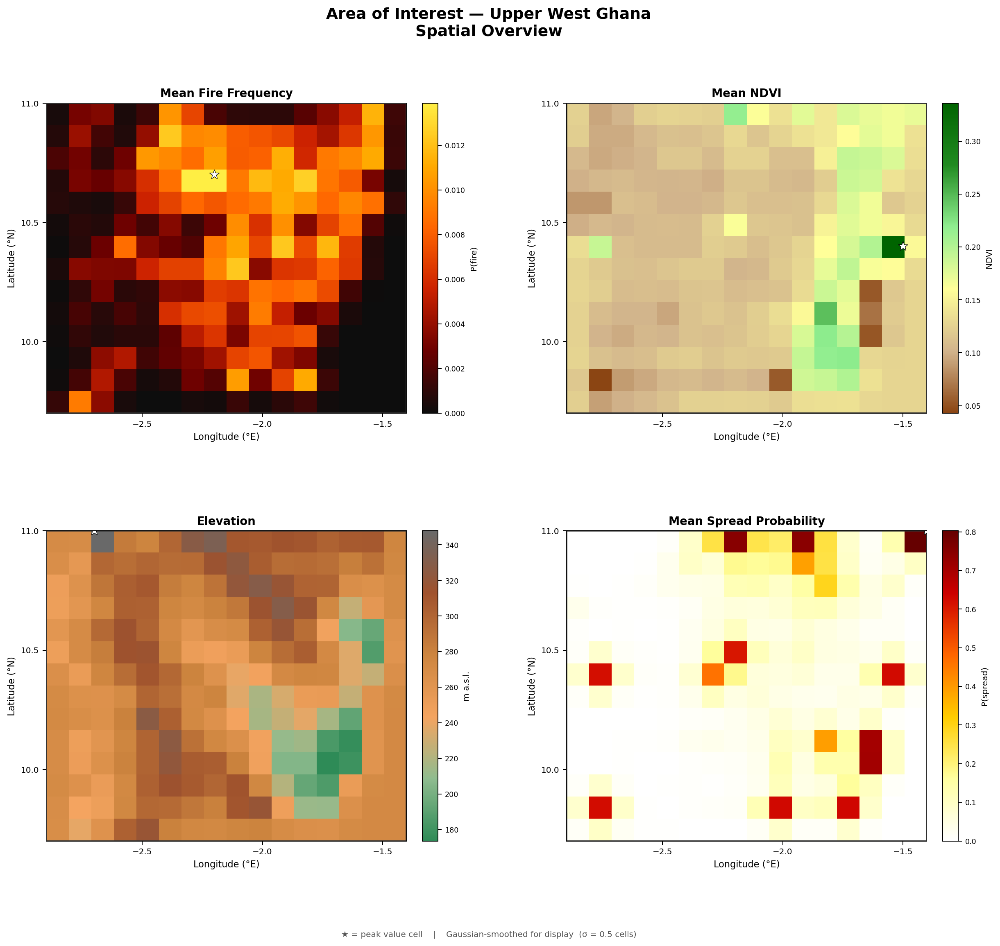
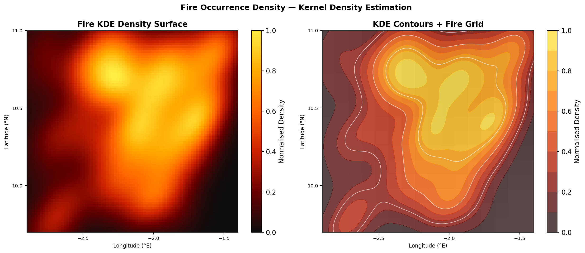
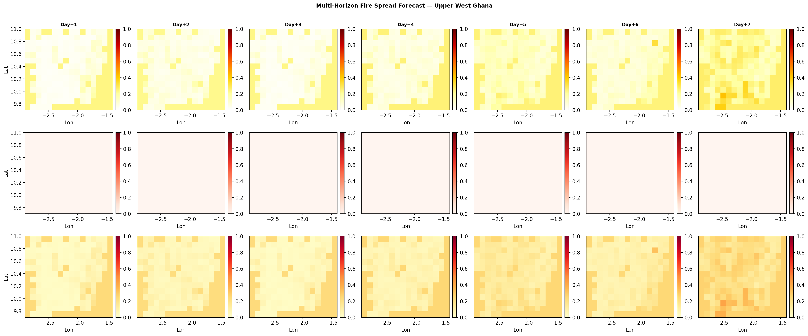
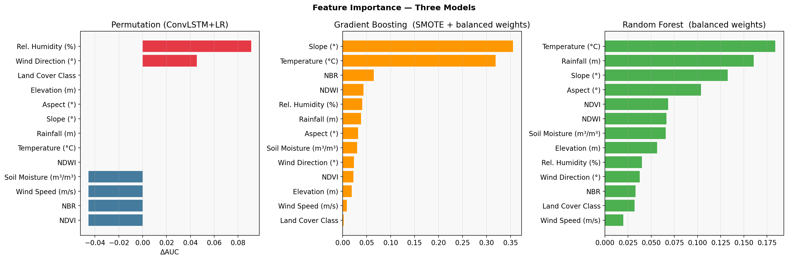
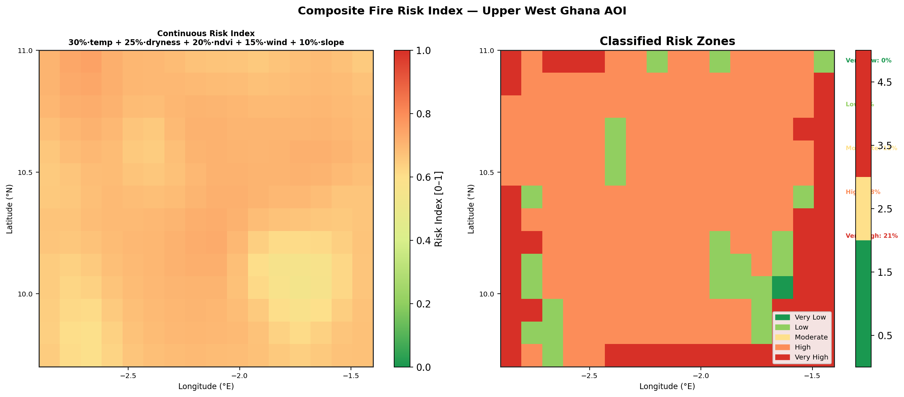

# 🔥 AI-Based Wildfire Spread Prediction — Upper West Ghana


A complete end-to-end spatiotemporal machine learning pipeline for predicting wildfire spread up to **seven days ahead** across Upper West Ghana, integrating Sentinel-2, MODIS, and ERA5-Land data with a ConvLSTM ensemble model.

> 📄 **Full Research Report:** [Research_Report.md](Research_Report.md)

---

## 🎯 Key Results

| Metric | Day+1 | Day+3 (Peak) |
|--------|-------|--------------|
| ROC AUC | 0.831 ± 0.160 | **0.865** |
| F1 Score | 0.571 ± 0.288 | **0.769** |
| Avg Precision | 0.464 ± 0.337 | 0.716 ± 0.402 |

- **21%** of the study domain classified as Very High fire risk
- **26.4:1** class imbalance successfully handled through multi-strategy correction
- Strict temporal leakage prevention via expanding-window cross-validation

---

## 🗺️ Study Area and Fire Activity

<p align="center">
  
</p>
<p align="center"><em>Spatial overview of Upper West Ghana AOI: mean fire frequency, NDVI, elevation, and spread probability.</em></p>

<p align="center">
  
</p>
<p align="center"><em>Kernel Density Estimation of fire occurrence, showing primary hotspot centred around 2.0°W, 10.8°N.</em></p>

---

## 🏗️ Pipeline Overview

```
Sentinel-2 + MODIS + ERA5-Land + Terrain
                    │
                    ▼
         ┌─────────────────┐
         │   Preprocessing  │  3-day composites, cloud masking
         └────────┬────────┘
                  │
        ┌─────────┴─────────┐
        ▼                   ▼
  ┌──────────┐        ┌──────────────┐
  │ ConvLSTM │        │  GB  +  RF   │
  │ (spatial)│        │  (tabular)   │
  │  w=0.50  │        │ w=0.30+0.20  │
  └────┬─────┘        └──────┬───────┘
       └──────────┬──────────┘
                  ▼
        ┌──────────────────┐
        │  Ensemble Output  │  Days +1 through +7
        └──────────────────┘
```

**ConvLSTM:** hidden dim 16, Focal Loss (α=0.90, γ=2.0), Adam lr=2×10⁻³, 25 epochs

**Tabular:** Gradient Boosting (150 est., depth 4) + Random Forest (200 est., depth 8)

---

## 📊 Model Performance

<p align="center">
  
</p>
<p align="center"><em>Per-fold Day+1 metrics across four completed CV folds. AUC mean = 0.831, F1 mean = 0.571.</em></p>

<p align="center">
  
</p>
<p align="center"><em>Cross-validated mean ± 1σ performance across forecast horizons Days+1 to +7.</em></p>

---

## 🗺️ Spatial Forecast

<p align="center">
  
</p>
<p align="center"><em>Multi-horizon fire spread forecast. Top: predicted probability. Middle: observed spread. Bottom: absolute error. Columns = Day+1 through Day+7.</em></p>

---

## 🔬 Feature Importance

<p align="center">
  
</p>
<p align="center"><em>Feature importance across ConvLSTM, Gradient Boosting, and Random Forest. Relative humidity and slope are dominant drivers.</em></p>

---

## 🗺️ Risk Mapping

<p align="center">
  
</p>
<p align="center"><em>Composite Fire Risk Index. 21% of domain classified as Very High risk, 38% as High risk.</em></p>

<p align="center">
  
</p>
<p align="center"><em>Vulnerability quadrant analysis: Exposure vs Sensitivity coloured by composite risk.</em></p>

---

## ⚙️ Installation

```bash
git clone https://github.com/afriyieattaphilip/AI-Remote-Sensing-for-Wildfire-Prediction.git
cd AI-Remote-Sensing-for-Wildfire-Prediction

pip install -r requirements.txt
earthengine authenticate

python models/pipeline.py --study_area upper_west_ghana --horizons 7
```

---

## ⚠️ Limitations and Future Work

- Spatial resolution of 0.1° (~11 km) is coarse relative to individual fire perimeters
- Four fire seasons (2019 to 2023) limit training data — extending to 2010 to 2024 is planned
- ConvLSTM is currently NumPy-based; porting to PyTorch for GPU acceleration is next
- Probability calibration requires post-hoc Platt scaling for operational use

---

## 👤 Author

**Philip Atta Afriyie**
Geospatial Machine Learning Engineer | Remote Sensing | Agronomy | Spatiotemporal Modeling
📧 afriyieattaphilip@gmail.com | 📍 Göttingen, Germany
🔗 [LinkedIn](https://linkedin.com) · [GitHub](https://github.com/afriyieattaphilip)

*M.Sc. Sustainable International Agriculture, Georg-August University of Göttingen*

---

## 📝 License

MIT License. See `LICENSE` for details.
