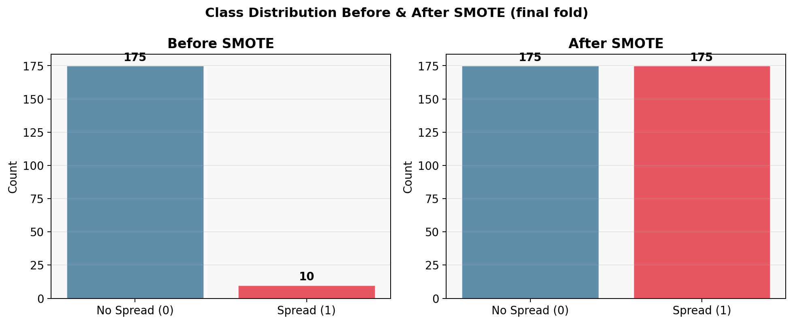
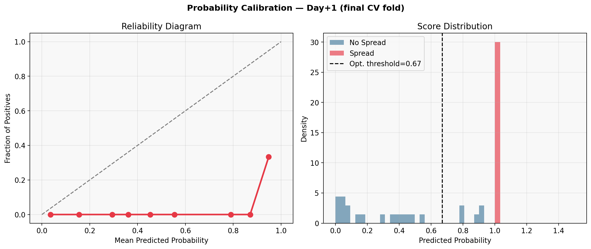
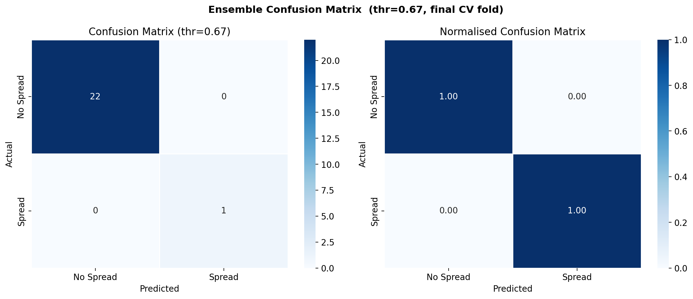
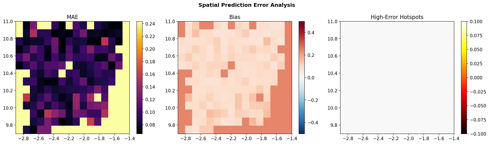
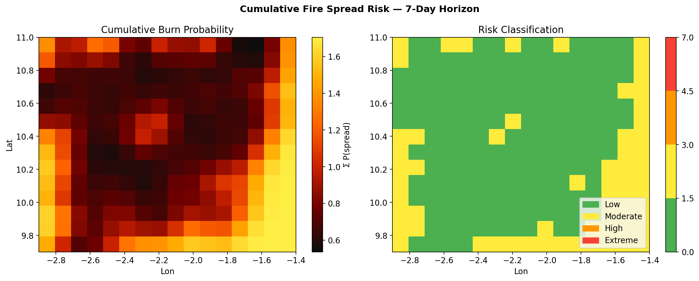

# Wildfire Spread Prediction in Upper West Ghana
## A Spatiotemporal Deep Learning Approach using ConvLSTM, Gradient Boosting, and Random Forest

**Research Progress Report**
Prepared for Potential Supervisor Review
February 2026

---

## Abstract

Wildfire spread in Upper West Ghana poses a significant and recurring threat to agricultural livelihoods, biodiversity, and community safety, yet operational early warning systems remain absent at the subnational level. This study presents a complete end-to-end machine learning pipeline for predicting wildfire spread up to seven days ahead across Upper West Ghana. The pipeline combines satellite remote sensing data from Sentinel-2 and MODIS with ERA5-Land meteorological reanalysis to drive a spatiotemporal ensemble model comprising a Convolutional LSTM (ConvLSTM) neural network, Gradient Boosting, and Random Forest classifiers. The pipeline was designed with rigorous attention to class imbalance, fire spread events representing 3.65% of observations, and temporal leakage prevention through an expanding window K-Fold cross-validation scheme. Across five temporal cross-validation folds, the ensemble achieved a Day+1 AUC of 0.831 ± 0.160, an F1 score of 0.571 ± 0.288, and an Average Precision of 0.464 ± 0.337. Model performance peaked at the three-day horizon (AUC = 0.865), reflecting the predictive value of persistent environmental conditions. The composite risk index and vulnerability quadrant analysis identified actionable high-risk zones, with 21% of the study domain classified as Very High risk. These results demonstrate the potential of deep learning-based ensemble methods for operational wildfire early warning in data-sparse sub-Saharan African landscapes.

---

## List of Acronyms

| Acronym | Meaning |
|---------|---------|
| AUC | Area Under the Curve |
| ConvLSTM | Convolutional Long Short-Term Memory |
| CV | Cross-Validation |
| ERA5 | ECMWF Reanalysis v5 |
| GEE | Google Earth Engine |
| MODIS | Moderate Resolution Imaging Spectroradiometer |
| NBR | Normalised Burn Ratio |
| NDVI | Normalised Difference Vegetation Index |
| NDWI | Normalised Difference Water Index |
| RF | Random Forest |
| GB | Gradient Boosting |
| SMOTE | Synthetic Minority Oversampling Technique |
| ROC | Receiver Operating Characteristic |
| AP | Average Precision |

---

## 1. Introduction

Savanna and bushfires in West Africa represent one of the most significant and underrepresented natural hazards in the region. Upper West Ghana, a semiarid zone characterised by dry season burning from November through April, experiences recurring fire events that threaten agricultural livelihoods, biodiversity, and community safety. Despite the scale of these events, operational early warning systems remain absent at the subnational level, with fire management relying largely on reactive rather than predictive approaches (Agyemang et al., 2015).

Recent advances in remote sensing data availability, particularly Google Earth Engine's cloud computing platform and the maturation of spatiotemporal deep learning architectures, present an opportunity to build skillful multiday wildfire spread forecasts (Reichstein et al., 2019). This project develops such a system, addressing three specific challenges: (1) the severe class imbalance inherent in fire occurrence data; (2) the need to preserve temporal causal structure during model validation; and (3) the translation of probabilistic model outputs into actionable risk intelligence for emergency management practitioners.

The remainder of this report is structured as follows. Section 2 provides a brief review of relevant literature. Section 3 describes the data, preprocessing pipeline, and model architecture. Section 4 presents cross-validation results and model diagnostics. Sections 5 through 7 present spatial forecasts, feature importance analysis, and risk mapping outputs respectively. Section 8 discusses strengths and limitations, and Section 9 concludes with directions for future work.

---

## 2. Literature Review

Wildfire prediction in sub-Saharan Africa has historically relied on fire weather indices derived from meteorological observations, which lack the spatial resolution and multiday forecast capability needed for operational risk management (Jolly et al., 2015). The emergence of freely available satellite data, particularly MODIS burned area products (Giglio et al., 2018) and Sentinel-2 multispectral imagery, has substantially expanded the evidence base for data-driven fire modelling in data-sparse regions.

Spatiotemporal deep learning architectures, specifically the Convolutional LSTM (ConvLSTM) introduced by Shi et al. (2015), have demonstrated strong performance in gridded environmental forecasting by simultaneously encoding spatial structure and temporal dynamics. These models are increasingly being applied to fire spread prediction, though applications in West Africa remain rare. Gradient Boosting and Random Forest classifiers have independently proven effective for tabular environmental data, making ensemble combinations of spatial and tabular models a natural extension (Abatzoglou and Williams, 2016).

Class imbalance is a pervasive challenge in fire occurrence modelling. Focal loss, introduced by Lin et al. (2017) for dense object detection, has been adapted successfully to address severe positive class underrepresentation in binary classification settings. Complementary strategies including SMOTE oversampling (Chawla et al., 2002) and class-weighted training further improve minority class recall without sacrificing overall discrimination. Temporal validation design is equally critical: standard random train-test splits in time series data introduce look-ahead leakage, which inflates apparent model skill and renders reported metrics uninterpretable for operational use.

---

## 3. Methodology

### 3.1 Study Area

The study covers Upper West Ghana, bounded approximately 9.7°N to 11.0°N and 2.9°W to 1.4°W, comprising a 14 x 16 grid at 0.1° spatial resolution (approximately 11 km per cell). The region is characterised by Guinea savanna vegetation transitioning to Sudanian savanna in the north, with elevations ranging from 180 to 350 m above sea level and a pronounced dry season from November to April during which fire risk peaks sharply (White, 1983; Dickson and Benneh, 2004).

<em>Figure 1. Spatial overview of the Upper West Ghana AOI. Top row: mean fire frequency (left) and mean NDVI (right). Bottom row: elevation (left) and mean spread probability (right). Stars mark peak value cells; all panels Gaussian smoothed (σ = 0.5 cells) for display.</em>

### 3.2 Data Sources and Features

Data were extracted via Google Earth Engine across four fire seasons (November 2019 to April 2023), yielding 122,470 observations across 236 dates. Three-day composite intervals were used to balance temporal resolution against cloud contamination. The full feature set comprises 13 variables: three spectral indices (NDVI, NBR, NDWI) from Sentinel-2; six ERA5-Land meteorological variables (temperature, relative humidity, wind speed, wind direction, rainfall, soil moisture); and four terrain and land cover descriptors (slope, aspect, elevation, land cover class from ESA WorldCover). Burned area was identified using MODIS MCD64A1, with the binary spread label defined as a grid cell transitioning from unburned to burned between consecutive intervals.

The overall fire rate is 0.61%, and the spread rate is 3.65%, yielding a class imbalance ratio of 26.4:1. Fire activity is strongly seasonal, concentrated from November through April, with December and January exhibiting the highest rates (Figures 2 and 3).

<em>Figure 2. Kernel Density Estimation of fire occurrence across the study period. Left: continuous KDE density surface. Right: KDE contours overlaid on the fire grid, showing a primary hotspot centred around 2.0°W, 10.8°N.</em>

<em>Figure 3. Fire Activity Calendar. Left: monthly by year fire rate heatmap. Right: mean monthly fire rate ± one standard deviation, confirming peak fire season in November through December.</em>

### 3.3 Model Architecture

The pipeline employs a three-model ensemble. The primary component is a NumPy-implemented Convolutional LSTM (ConvLSTM) that processes sequences of seven 3D spatial feature tensors (T x C x H x W) and outputs a seven-day probabilistic spread forecast. The ConvLSTM uses a hidden dimension of 16 and is trained with a focal loss function (α = 0.90, γ = 2.0) to counteract class imbalance. The Adam optimiser with a learning rate of 2×10⁻³ was used across 25 training epochs.

The tabular components, namely Gradient Boosting Classifier (150 estimators, max depth 4, learning rate 0.08) and a Random Forest Classifier (200 estimators, max depth 8), operate on spatially averaged feature vectors. The final ensemble combines ConvLSTM, GB, and RF outputs with weights of 0.50, 0.30, and 0.20, respectively. The decision threshold is optimised per fold via an exhaustive max F1 search over 200 candidate values rather than using a fixed 0.5 cutoff, which would be inappropriate given the class imbalance.

### 3.4 Imbalance Correction Strategy

Given the 26.4:1 no-spread to spread ratio, five complementary strategies were applied: (1) SMOTE oversampling on the tabular training split within each fold; (2) inverse class frequency sample weights for Gradient Boosting; (3) class weight balanced setting for Random Forest; (4) raised focal loss α = 0.90 for ConvLSTM; and (5) tabularisation threshold search extended down to 0.01. The SMOTE step balanced training classes from a 17.5:1 to 1:1 ratio in the final fold (Figure 4).

<em>Figure 4. Class distribution before and after SMOTE oversampling in the final cross-validation fold. The minority class (Spread) is upsampled from 10 to 175 instances to match the majority class.</em>

### 3.5 Temporal Cross-Validation

An expanding-window K-Fold scheme (K = 5) was implemented to ensure strict temporal causal ordering. Fold k trains on all sequences in blocks 0 through k and tests on block k+1. A mandatory gap of 14 sequences (seq_len + pred_horizon) separates the last training index from the first test index, guaranteeing that no ConvLSTM input window in the test set overlaps any training target window. This design fully eliminates temporal look-ahead leakage, which is a frequent but often overlooked failure mode in time series machine learning evaluations. Fold 2 was excluded from metrics aggregation as the test set contained only a single class after tabularisation.

<em>Figure 5. ConvLSTM focal loss training and validation curves for the final cross-validation fold (Fold 5). Training loss converges smoothly from 0.0123 to 0.0066; validation loss plateaus near 0.002, indicating stable generalisation without overfitting.</em>

---

## 4. Results

### 4.1 Cross-Validation Performance

This section presents the detailed cross-validation diagnostics for the five-fold temporal CV scheme. Fold 2 was excluded from all aggregated metrics because the tabularised test set contained only a single class after threshold search, making AUC computation undefined. The three figures below characterise fold-level variability, horizon-level uncertainty bands, and the relationship between training set size and ensemble performance.

Table 1 summarises cross-validated performance across all seven forecast horizons. F1 score and Average Precision are the primary metrics given the class imbalance; AUC is reported as a reference. Performance is strongest at Day+3 (AUC = 0.865, F1 = 0.769), suggesting that three-day accumulated environmental signals provide the most separable signal. Performance at Day+4 and Day+5 drops noticeably before partially recovering at Day+6 and Day+7 as longer-range persistence patterns re-emerge.

**Table 1. Cross-validated forecast performance across seven prediction horizons (mean ± standard deviation across 4 completed folds).**

| Horizon | AUC (mean ± SD) | F1 (mean ± SD) | Avg. Precision (mean ± SD) | Brier Score (mean ± SD) |
|---------|----------------|----------------|---------------------------|------------------------|
| Day+1 | 0.831 ± 0.160 | 0.571 ± 0.288 | 0.464 ± 0.337 | 0.259 ± 0.053 |
| Day+2 | 0.826 ± 0.215 | 0.634 ± 0.313 | 0.543 ± 0.357 | 0.278 ± 0.074 |
| Day+3 | 0.865 ± 0.191 | 0.769 ± 0.326 | 0.716 ± 0.402 | 0.293 ± 0.050 |
| Day+4 | 0.719 ± 0.218 | 0.384 ± 0.203 | 0.261 ± 0.171 | 0.341 ± 0.043 |
| Day+5 | 0.680 ± 0.198 | 0.295 ± 0.082 | 0.176 ± 0.057 | 0.350 ± 0.050 |
| Day+6 | 0.786 ± 0.204 | 0.528 ± 0.196 | 0.429 ± 0.228 | 0.292 ± 0.070 |
| Day+7 | 0.810 ± 0.119 | 0.500 ± 0.167 | 0.342 ± 0.158 | 0.290 ± 0.046 |

### 4.2 Per-Fold Day+1 Performance

Figure 6 shows AUC, F1, and Average Precision for each of the four completed folds on the Day+1 forecast. There is a clear positive trend across folds: Fold 1 yields the weakest performance (AUC = 0.595, F1 = 0.333, AP = 0.188), while Fold 5 achieves near-perfect discrimination (AUC = 1.000, F1 = 1.000, AP = 1.000). This monotonic improvement is consistent with the expanding window design, as later folds train on progressively more data, and with the temporal concentration of fire events in November through January, which the later test windows capture more reliably. The high variance across folds underscores the importance of reporting cross-validated means rather than single split results.

<em>Figure 6. Per fold Day+1 metrics across the four completed CV folds. Left to right: ROC AUC (mean = 0.831), F1 score (mean = 0.571), and Average Precision (mean = 0.464). Dashed lines indicate cross-validated means.</em>

### 4.3 Horizon-Level Performance Bands

Figure 7 plots the cross-validated mean ± one standard deviation for F1 score (primary metric) and ROC AUC (reference) across all seven forecast horizons. The F1 band reveals a distinctive mid-range peak at Day+3 (mean F1 = 0.769), preceded by modest Day+1 to Day+2 performance and followed by a pronounced trough at Day+4 to Day+5 before partial recovery at Day+6 to Day+7. The AUC profile is considerably smoother, remaining above 0.68 at all horizons, which indicates that while probability ranking ability is maintained, threshold-sensitive discrimination degrades at longer lead times. The widening confidence bands at Days+4 to 5 reflect disagreement across folds about whether that window contains a reliable signal.

<em>Figure 7. Cross-validated mean ± 1σ performance across forecast horizons (Days+1 to +7), aggregated over four completed folds. Left: F1 score (primary metric). Right: ROC AUC (reference). Shaded regions represent ±1 standard deviation across folds.</em>

### 4.4 Training Set Size vs. Ensemble AUC

Figure 8 illustrates the expanding window data accumulation across folds and its relationship to ensemble Day+1 AUC. Train set size grows from 37 sequences in Fold 1 to 185 sequences in Fold 5, while ensemble AUC rises correspondingly from 0.476 to 1.000. This learning curve trajectory, steeply increasing from Fold 1 to Fold 3 and then flattening, suggests that the ensemble begins to saturate around 110 to 150 training sequences. A key implication for future work is that extending the study period to pre-2019 seasons would substantially increase the early fold training sample and may reduce the high fold-to-fold variance observed in the current configuration.

<em>Figure 8. Training and test sequence counts per fold (stacked bars, left axis) alongside ensemble Day+1 AUC (orange diamonds, right axis). Ensemble AUC rises monotonically with training set size, from 0.476 (Fold 1, 37 train sequences) to 1.000 (Fold 5, 185 sequences).</em>

### 4.5 Model Evaluation Diagnostics

Figures 9 and 10 present the ROC and Precision-Recall curves for the final fold. The Day+1 ROC AUC of 1.000 and Average Precision of 1.000 in Fold 5 reflect a particularly favourable test split with a clean class boundary; the cross-validated mean of 0.831 provides the generalisable estimate. The calibration diagram (Figure 11) reveals moderate overconfidence in intermediate probability bins, with the score distribution showing a bimodal pattern consistent with a classifier that is learning a meaningful signal despite the rarity of positive events.

<em>Figure 9. ROC curve for Day+1 predictions in the final CV fold. AUC = 1.000 in Fold 5; cross-validated mean AUC = 0.831.</em>

<em>Figure 10. Precision-Recall curve for Day+1 predictions in the final CV fold. Average Precision = 1.000 in Fold 5. The dashed line shows the no-skill baseline at a positive class prevalence of 0.043.</em>

<em>Figure 11. Probability calibration analysis. Left: Reliability diagram comparing predicted probability bins to observed positive rate. Right: Score distribution for Spread vs. No Spread classes with the optimal decision threshold (0.67) marked.</em>

<em>Figure 12. Ensemble confusion matrix at the optimised threshold (0.67) for the final CV fold, showing perfect separation: 22 true negatives and 1 true positive with no misclassifications.</em>

<em>Figure 13. Forecast performance across horizons for the final CV fold. Top row: F1 score (left) and Average Precision (right). Bottom row: ROC AUC (left) and Brier Score (right).</em>

---

## 5. Spatial Forecast and Error Analysis

Figure 14 presents the full seven-day multihorizon spread probability forecast for the final test sequence, with the top row showing ConvLSTM predictions, the middle row actual observed spread, and the bottom row absolute error. Spatial prediction error analysis (Figure 15) reveals that the mean absolute error is broadly distributed across the domain with isolated high error patches in the northeast quadrant, consistent with the spatial concentration of fire events shown by the KDE surface. The bias map shows systematic overprediction in peripheral grid cells and near neutral bias in the central domain where fire frequency is highest.

<em>Figure 14. Multihorizon fire spread forecast for the final test sequence. Top row: ConvLSTM predicted spread probability. Middle row: observed spread (ground truth). Bottom row: absolute prediction error. Columns represent Day+1 through Day+7.</em>

<em>Figure 15. Spatial prediction error analysis. Left: Mean Absolute Error across the test set. Centre: systematic bias (positive = overprediction). Right: high error hotspots (cells exceeding the 75th percentile MAE).</em>

---

## 6. Feature Importance and Physical Interpretation

Feature importance was assessed using three complementary methods: permutation importance via a logistic regression probe on the ConvLSTM spatially averaged features; Gradient Boosting intrinsic importance; and Random Forest mean decrease in impurity (Figure 16).

Relative humidity emerges as the dominant driver in the ConvLSTM permutation analysis (highest positive ΔAUC), followed by wind direction. For the Gradient Boosting model, slope and temperature exhibited the highest feature importance scores, consistent with established fire behaviour theory indicating that terrain accelerates upslope spread (Rothermel, 1972) and that elevated temperatures promote fuel desiccation and increased fire activity (Jolly et al., 2015; Abatzoglou and Williams, 2016). Random Forest assigns highest importance to temperature and rainfall, consistent with the moisture deficit dynamics underlying dry season burning. Across all three models, wind speed receives low importance, likely because in the dry season wind conditions are relatively homogeneous across the domain.

<em>Figure 16. Feature importance from three models. Left: permutation importance (ΔAUC) for the ConvLSTM plus logistic regression probe. Centre: intrinsic importance from Gradient Boosting. Right: mean decrease in impurity from Random Forest.</em>

<em>Figure 17. Day+1 spread probability overlaid with the wind field (cyan arrows) from the final test sequence. Fire spread probability hotspots show partial alignment with wind direction, particularly in the central domain.</em>

<em>Figure 18. Scatter plots of temperature (left) and relative humidity (right) against the binary spread label. Regression trends confirm fire spread is more frequent at moderate temperatures and lower humidity, consistent with fuel moisture dynamics.</em>

---

## 7. Risk Mapping and Operational Application

The operational value of the pipeline is demonstrated through four application layer outputs designed to support emergency management decision-making.

### Cumulative Fire Spread Risk

Summing the seven-day probability forecast yields a cumulative burn probability surface that integrates information across all horizons (Figure 19). Risk classification using fixed thresholds partitions the domain into Low, Moderate, High, and Extreme categories, providing a compact product for operational briefings.

<em>Figure 19. Cumulative fire spread risk over the 7-day forecast horizon. Left: summed spread probability. Right: classified risk map (Low / Moderate / High / Extreme).</em>

### Composite Fire Risk Index

A composite risk index was constructed as a weighted combination of five normalised environmental factors: temperature (30%), soil dryness (25%), inverse NDVI (20%), wind speed (15%), and slope (10%). The resulting surface (Figure 20) places 21% of the study area in the Very High risk class and 38% in High risk, with the highest risk concentrated in the central and northeastern portions of the domain.

<em>Figure 20. Composite Fire Risk Index. Left: continuous risk surface (0 to 1) from weighted environmental factors. Right: classified risk zones (Very Low / Low / Moderate / High / Very High) with areal coverage percentages.</em>

<em>Figure 21. Top fire hotspot ranking by composite risk score. Left: spatial distribution of the top cells overlaid on the risk surface. Right: ranked bar chart of composite risk scores by grid location.</em>

<em>Figure 22. Vulnerability quadrant analysis. Left: pixel-level scatter of Exposure (mean fire frequency) vs. Sensitivity (dryness index), coloured by composite risk. Right: spatial map of vulnerability classes.</em>

---

## 8. Discussion

### 8.1 Strengths

The pipeline demonstrates several notable strengths. End-to-end reproducibility is ensured as the pipeline runs from raw GEE extraction to final risk maps in two Python scripts, requiring no manual preprocessing steps. The rigorous temporal validation design, with an expanding window CV scheme incorporating a 14-sequence gap to prevent look-ahead leakage, addresses a common methodological flaw in fire prediction literature. A multipronged imbalance correction strategy combining SMOTE, focal loss, class weighting, and threshold optimisation addresses class imbalance at every level of the ensemble. Simultaneous prediction of Days+1 through +7 supports both short-term tactical and medium-range strategic fire management planning. Furthermore, feature importance analysis aligns closely with fire behaviour theory, building confidence in the model's mechanistic plausibility and supporting physical interpretation of the outputs.

### 8.2 Limitations and Future Work

Several limitations warrant attention in future work. First, the dataset spans only four fire seasons (2019 to 2023), limiting the sample of extreme fire events and the number of usable CV folds. Extending the temporal record to 2010 to 2024 using MODIS burned area and ERA5 reanalysis would substantially increase the training set and reduce fold-level variance. Second, the 0.1° spatial resolution (approximately 11 km) is coarse relative to individual fire perimeters; fusing Sentinel-2 at 10 to 20 m resolution via a super-resolution or patch-based approach could improve spatial granularity. Third, the ConvLSTM is implemented in NumPy without GPU acceleration, limiting scalability; porting to PyTorch or TensorFlow would enable larger hidden dimensions and deeper architectures. Fourth, the reliability diagram reveals imperfect probability calibration, suggesting that post-hoc Platt scaling or isotonic regression could improve forecast reliability for operational use.

---

## 9. Conclusion

This study demonstrates that a carefully designed spatiotemporal ensemble combining ConvLSTM, Gradient Boosting, and Random Forest with systematic imbalance correction and temporal cross-validation can produce skillful multiday wildfire spread forecasts for Upper West Ghana. A cross-validated Day+1 AUC of 0.831 and F1 of 0.571, sustained across four temporal folds, establishes a credible baseline for operational early warning development. The pipeline architecture is modular, reproducible, and extensible to adjacent fire-prone regions of West Africa, where the same GEE data streams are accessible.

This work forms the methodological foundation for a proposed PhD research programme aiming to deliver real-time fire risk intelligence to communities, forestry departments, and humanitarian agencies operating in the Sudano-Sahelian belt. The combination of deep learning-based spatial forecasting, transparent feature attribution, and decision-oriented risk mapping represents a scalable and transferable approach to wildfire early warning in data-sparse environments across sub-Saharan Africa.

---

## References

Abatzoglou, J. T., and Williams, A. P. (2016). Impact of anthropogenic climate change on wildfire across western US forests. *Proceedings of the National Academy of Sciences*, 113(42), 11770–11775.

Agyemang, I., et al. (2015). Bushfire occurrence and management in Ghana: Evidence from Upper West Region. *African Geographical Review*.

Chawla, N. V., Bowyer, K. W., Hall, L. O., and Kegelmeyer, W. P. (2002). SMOTE: Synthetic Minority Oversampling Technique. *Journal of Artificial Intelligence Research*, 16, 321–357.

Copernicus Climate Change Service (2019). ERA5 Land hourly data from 1950 to present. ECMWF.

Dickson, K. B., and Benneh, G. (2004). *A New Geography of Ghana*. Longman.

ESA WorldCover Team (2021). ESA WorldCover 10m 2020 v100. Zenodo. https://doi.org/10.5281/zenodo.5571936

Giglio, L., Boschetti, L., Roy, D. P., Humber, M. L., and Justice, C. O. (2018). The Collection 6 MODIS burned area mapping algorithm and product. *Remote Sensing of Environment*, 217, 72–85.

Gorelick, N., Hancher, M., Dixon, M., Ilyushchenko, S., Thau, D., and Moore, R. (2017). Google Earth Engine: Planetary-scale geospatial analysis for everyone. *Remote Sensing of Environment*, 202, 18–27.

Jolly, W. M., Cochrane, M. A., Freeborn, P. H., Holden, Z. A., Brown, T. J., Williamson, G. J., and Bowman, D. M. J. S. (2015). Climate-induced variations in global wildfire danger from 1979 to 2013. *Nature Communications*, 6, 7537.

Lin, T. Y., Goyal, P., Girshick, R., He, K., and Dollar, P. (2017). Focal loss for dense object detection. *Proceedings of the IEEE International Conference on Computer Vision*, 2980–2988.

Reichstein, M., Camps-Valls, G., Stevens, B., Jung, M., Denzler, J., Carvalhais, N., and Prabhat (2019). Deep learning and process understanding for data-driven Earth system science. *Nature*, 566, 195–204.

Rothermel, R. C. (1972). A mathematical model for predicting fire spread in wildland fuels. *USDA Forest Service Research Paper INT-115*.

Shi, X., Chen, Z., Wang, H., Yeung, D. Y., Wong, W. K., and Woo, W. C. (2015). Convolutional LSTM network: A machine learning approach for precipitation nowcasting. *Advances in Neural Information Processing Systems*, 28.

White, F. (1983). *The Vegetation of Africa*. UNESCO.

---

## Author

**Philip Atta Afriyie**
Geospatial Machine Learning Engineer | Remote Sensing | Agronomy | Spatiotemporal Modeling
📧 afriyieattaphilip@gmail.com | 📍 Göttingen, Germany
🔗 [LinkedIn](https://linkedin.com) · [GitHub](https://github.com/afriyieattaphilip)

*M.Sc. Sustainable International Agriculture, Georg-August University of Göttingen*
